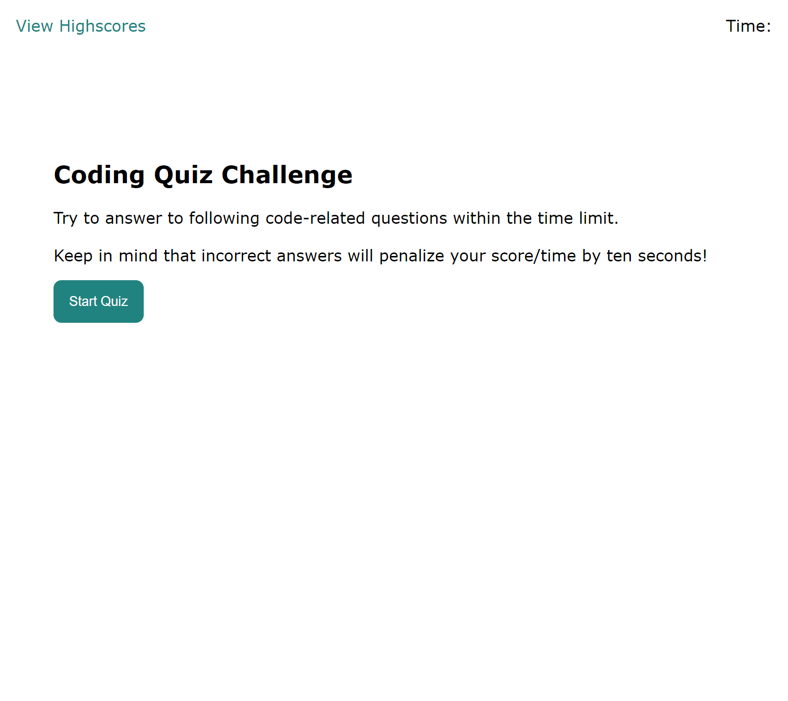
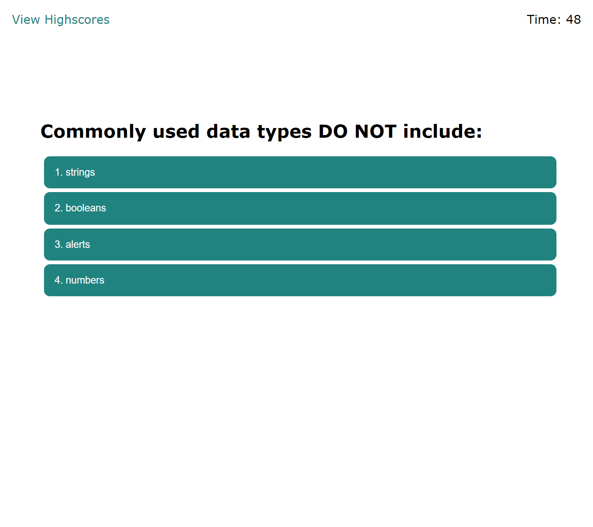
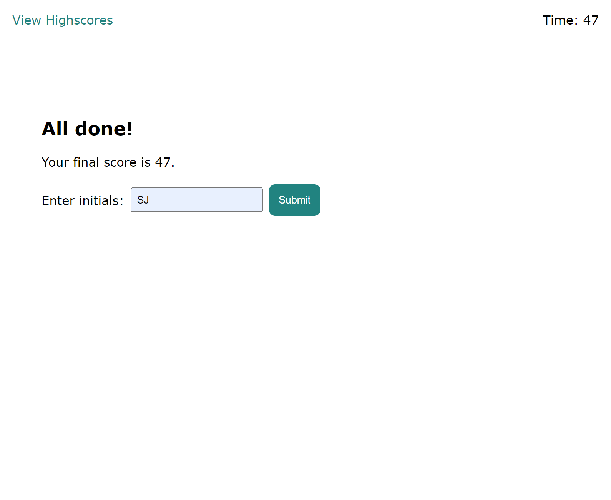
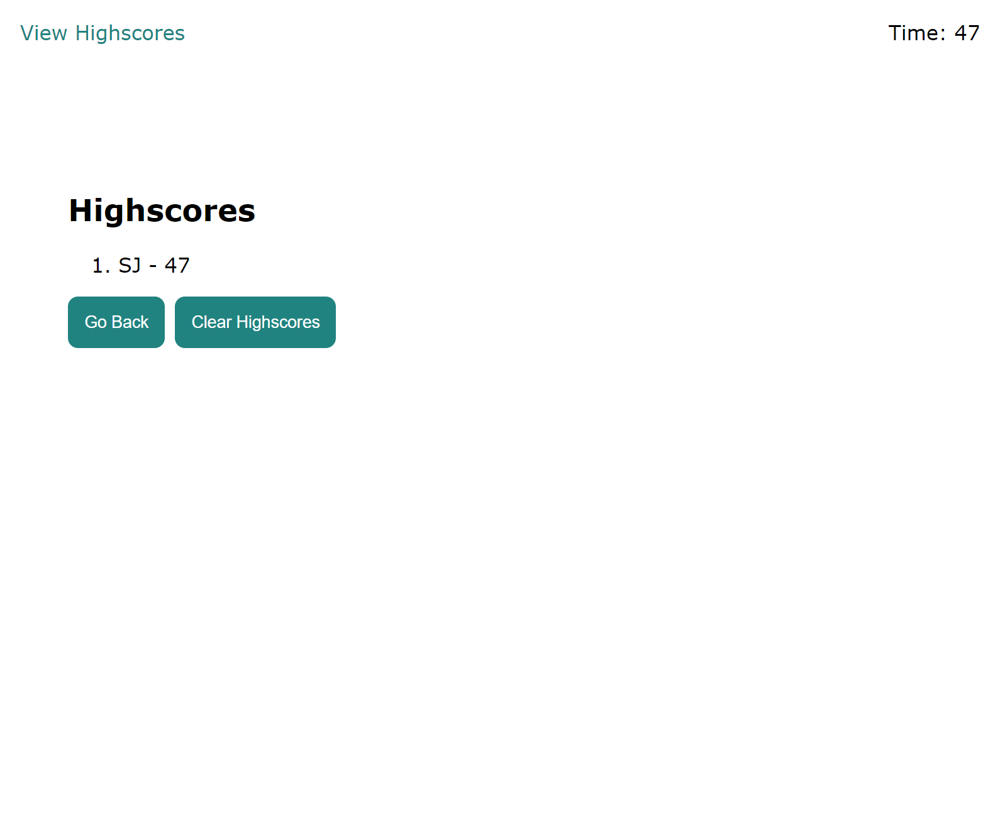

# javascript-quiz

## Project Outline

An interactive, timed JavaScript quiz that stores a high score leaderboard in local storage.
Developed in accordance with the following acceptance criteria: 

```
GIVEN I am taking a code quiz
WHEN I click the start button
THEN a timer starts and I am presented with a question
WHEN I answer a question
THEN I am presented with another question
WHEN I answer a question incorrectly
THEN time is subtracted from the clock
WHEN all questions are answered or the timer reaches 0
THEN the game is over
WHEN the game is over
THEN I can save my initials and my score
```

## Design Notes

* Responsive user interface achieved through the use of media queries

* Additional questions can be added without affecting functionality

## Link to Deployed Application

https://stephje.github.io/javascript-quiz/

## Screenshots of Deployed Application








